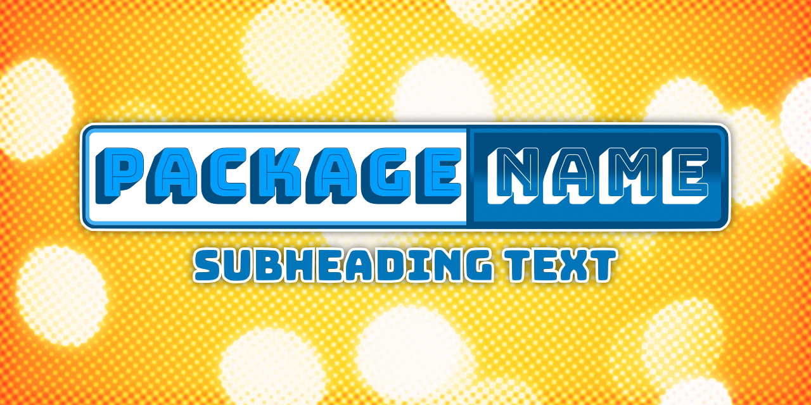

# Vite TypeScript Library Starter




<a href="https://github.com/matronator"></a>
<a href="https://github.com/sponsors/matronator/"></a>

A starter template to use for developing libraries with Vite and TypeScript.

## Tech-stack

-   [Bun](https://bunpkg.com/) - A package manager for the web (faster alternative to npm and yarn)
-   [Vite](https://vitejs.dev/) - A next-generation front-end tooling
-   [TypeScript](https://www.typescriptlang.org/) - A typed superset of JavaScript
-   [Vitest](https://vitest.dev/) - A test runner for Vite
-   [Prettier](https://prettier.io/) - An opinionated code formatter
-   [Renovate](https://www.mend.io/renovate/) - Automated dependency updates
-   [np](https://github.com/sindresorhus/np) - A better `npm publish`

## Installation

1. Clone this repository, or
2. Click on "Use this template" button, or
3. Download the repository as a ZIP file, or
4. Use [degit](https://github.com/Rich-Harris/degit), like this:

```
bunx degit matronator/vite-ts-lib-starter my-new-library
```

## After installation

1. Change the `package.json` file to match your library's name, description, author, etc.
2. Change the `outFile` field in the `dts-bundle-generator.config.js` file to match your library's name.
3. Replace the logo with your own.
4. Modify `FUNDING.yml` in the `.github` folder with your own values or remove it completely.
5. Replace the `README.md` file with your own.
6. Change the name in the `LICENSE.md` file.
7. Replace the `CHANGELOG.md` file with your own.
8. Start creating your library in the `src` folder.
9. Write some tests in the `tests` folder.
10. When you're ready to publish your library, run `npm run build` to generate the production files.
11. Publish your library to npm with either `npm publish`, or `npm run release` to use `np` for a better publishing experience.
